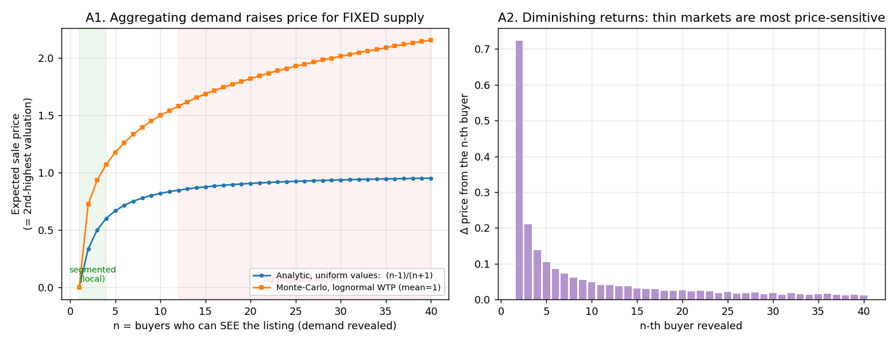
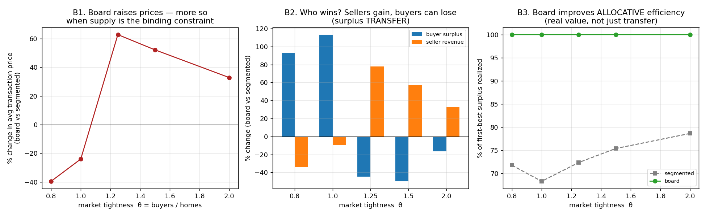
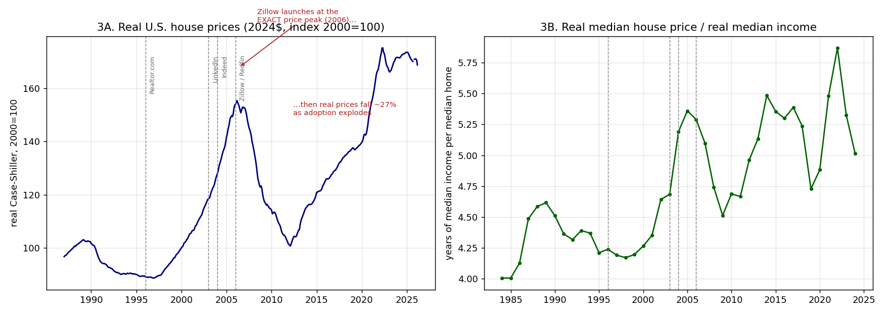
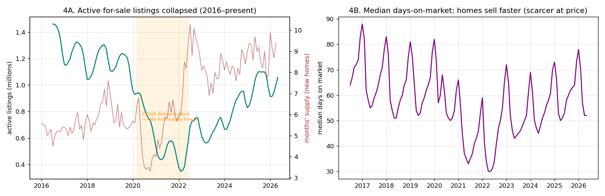
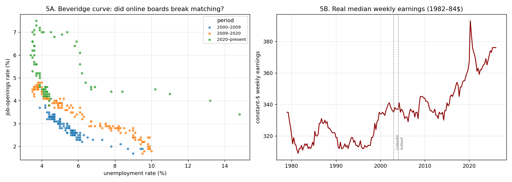

# Do "Asset Boards" Make Life-Changing Assets Scarce and Expensive?

### An economic analysis of whether platforms like Zillow and LinkedIn hurt consumers, with original simulation and data work

*Standalone research note. June 2026.*

---

## The hypothesis

> Apps that aggregate life-changing assets onto a single searchable board — **Zillow / Redfin / Realtor.com** for homes, **LinkedIn / Indeed** for jobs — have made those assets **scarcer and more expensive**, hurting consumers. One proposed channel is **latent-demand revelation**: pooling buyers/seekers who were previously dispersed across many local markets surfaces hidden demand, raises the effective number of bidders per listing, and bids up the price of a fixed stock.

This note tests that hypothesis three ways: (1) economic **theory**, (2) an **original simulation** that quantifies the latent-demand mechanism and decomposes its welfare effects, and (3) **original empirical analysis** of real housing and labor data. It draws on ~110 sources gathered and adversarially fact-checked across five research tracks (full citations in [`SOURCES.md`](SOURCES.md)).

---

## Verdict in one paragraph

The strong form of the hypothesis — "the platforms *created* the scarcity and are the *cause* of high prices" — **is not supported**. Platforms cannot reduce the physical stock of homes or jobs; the binding constraint on housing is **inelastic supply** (zoning, geography), and on "good jobs" it is **labor demand**, neither of which a listing board controls. The aggregate data are openly hostile to the simple story: **Zillow and Redfin both launched in 2006 — the exact peak of U.S. real house prices — after which real prices *fell ~35%* over six years while platform adoption exploded**. But a **weaker, conditional form of the hypothesis is correct and is the analytically interesting result**: when supply is already the binding constraint, latent-demand revelation **converts pre-existing scarcity into higher transaction prices and transfers surplus from buyers to sellers**, even as it makes the market more efficient overall. My simulation pins down *exactly when* this happens — the consumer effect flips sign at the scarcity threshold (buyers ≈ homes). The platform is best understood not as the arsonist but as an **accelerant**: it makes scarcity bind harder, faster, and more visibly, and redistributes the resulting rents toward sellers.

---

## 1. The mechanism is real — but it is an *auction* mechanism, not a *search-cost* mechanism

The phrase "latent demand revelation" is **not a named theorem** in economics (it is a marketing term; tutor2u), so the first task is to find its rigorous home. It has two:

**(a) Order statistics / auction theory — the clean version.** For a *fixed, contested* asset sold to the highest of *n* bidders, the expected sale price is the **second-highest valuation**, which is strictly increasing in *n*. For uniform private values, E[2nd-highest of *n*] = (*n*−1)/(*n*+1) — rising from 0.5 at *n*=2 toward 1 as *n*→∞ (Easley & Kleinberg, *Networks, Crowds and Markets*, ch. 9; revenue equivalence: Vickrey 1961, Riley–Samuelson 1981, Myerson 1981). Aggregating segmented buyers onto one board is formally equivalent to **enlarging the bidder pool per listing**, so for genuinely scarce supply, expected price rises. This is the defensible core of the hypothesis.

**(b) Market integration / law of one price.** When segmented markets integrate, prices **rise in the formerly-cheap "surplus" region** and fall in the formerly-expensive one, converging (Engel–Rogers). A national board integrating local housing markets therefore *raises* prices where listings were previously cheap and locally trapped — even with no change in supply.

**What the mechanism is *not*.** A tempting but wrong version is "boards lower search costs, which raises prices." Search theory says the opposite is at least as likely:
- **Diamond paradox** (Diamond 1971; 2010 Nobel background): driving search cost *toward zero* pushes price *toward competitive*, not up — the discontinuity is at exactly zero.
- The welfare/price effect of search frictions is formally **ambiguous and non-monotone** (Mortensen–Pissarides; thick-market vs. congestion externalities, pinned down only by the knife-edge Hosios 1990 condition).
- **Bakos (1997)** predicts lower buyer search costs *reduce* sellers' market power in differentiated markets.

> **So the hypothesis must run through demand *pooling* / bidder-pool enlargement against fixed supply — not through "cheaper search" in general.** That distinction is the analytical spine of everything below.

---

## 2. Original simulation: quantifying latent-demand revelation

Code: [`code/01_simulation.py`](code/01_simulation.py). Pure simulation, no external data.

### Experiment A — one scarce asset, varying the revealed bidder pool

A single unique home/job sold via competitive (second-price) bidding to *n* buyers who can *see* it. Going from a thin local market to a thick national board raises the expected sale price substantially, for **fixed supply**:

| Transition (buyers who can see the listing) | Expected price (mean WTP = 1.0) | Change |
|---|---|---|
| local (3) → metro board (15) | 0.93 → 1.68 | **+81%** |
| local (3) → national board (30) | 0.93 → 2.01 | **+116%** |
| regional (5) → national board (25) | 1.17 → 1.93 | **+64%** |



The effect has **steeply diminishing returns** (right panel): thin markets are wildly price-sensitive to extra revealed bidders; thick markets are not. This already tells us *where* the hypothesis should bite — in markets that were previously thin/segmented and are supply-constrained.

### Experiment B — a full equilibrium assignment market (the decomposition)

This is the core original contribution. I simulate a market of **H = 60 fixed homes** and **B buyers** (unit demand), where buyer *i*'s value for home *j* is a **common vertical quality** (everyone agrees SF > Fresno) **plus an idiosyncratic horizontal taste** (you love a loft, I love a craftsman). Two regimes:

- **Segmented** — the market is split into 6 "islands"; a buyer sees only listings on her island (the pre-internet world).
- **Board** — every buyer sees every listing (the Zillow world).

I solve each market for its **competitive-equilibrium prices and assignment** with a forward auction algorithm (Bertsekas) augmented with **individual rationality** (no one bids above their valuation), then measure prices, total surplus, and *who captures it*. I sweep **market tightness θ = buyers / homes** from 0.8 (ample supply) to 2.0 (acute scarcity).



| θ (buyers/homes) | Avg price | Total surplus | **Buyer surplus** | Seller revenue | Allocative efficiency (seg → board) |
|---|---|---|---|---|---|
| 0.8 (ample supply) | **−40%** | +39% | **+93%** | −34% | 0.72 → 1.00 |
| 1.0 (balanced) | **−24%** | +46% | **+113%** | −10% | 0.68 → 1.00 |
| 1.25 (tight) | **+63%** | +39% | **−45%** | +78% | 0.72 → 1.00 |
| 1.5 (scarce) | **+52%** | +32% | **−50%** | +57% | 0.75 → 1.00 |
| 2.0 (acute scarcity) | **+33%** | +28% | **−17%** | +33% | 0.79 → 1.00 |

*(board vs. segmented; means over 20 simulations)*

Three findings fall out, and together they **adjudicate the hypothesis**:

**B1. The board's effect on consumers flips sign at the scarcity threshold θ ≈ 1.** When homes are not scarce (θ < 1), aggregation *lowers* prices and massively raises buyer surplus — the optimistic Brown–Goolsbee / Bakos result. When homes are scarce (θ > 1), the *same technology* raises prices 30–60% and destroys 17–50% of buyer surplus. **The platform did not change; the supply condition did.** This is the precise sense in which the original hypothesis is true: *latent-demand revelation hurts consumers if and only if supply is the binding constraint.*

**B2. Where it hurts buyers, it is largely a *transfer*, not destruction.** At θ > 1 sellers' revenue rises by roughly what buyers lose; total surplus still goes *up*. The "harm" is distributional — thick-market competition hands the gains-from-trade to the scarce side (sellers). This is the rigorous statement of the populist intuition that "these apps are great for sellers and brutal for buyers."

**B3. The board always achieves first-best allocative efficiency (1.00 vs. 0.68–0.79).** Aggregation creates *real* value by sorting each asset to the buyer who values it most. So the platforms are genuinely productivity-enhancing — the welfare debate is about **distribution and the price level**, not waste. Any honest anti-platform argument must concede this efficiency gain.

> **Bottom line of the simulation:** latent-demand revelation is real and can raise prices 30–60% for fixed supply — but it is a *scarcity-contingent, surplus-redistributing* mechanism, not a scarcity-*creating* one. Take away the binding supply constraint (θ < 1) and the very same platform becomes pro-consumer.

---

## 3. Original empirical analysis (real data)

Code: [`code/02_empirics.py`](code/02_empirics.py); series pulled live from FRED (St. Louis Fed). The simulation says the hypothesis needs **binding supply (θ > 1)** to hold. The data say that condition — not the platforms — is what actually moved.

### 3.1 Housing: the platform timing does *not* line up with a price break



- **Zillow and Redfin launched in February 2006 — the exact peak of real U.S. house prices.** Real Case-Shiller then **fell ~35% to its 2012 trough** *while* Zillow went from zero to ubiquitous. If listing aggregation mechanically inflated prices, this is the wrong picture.
- The post-2012 recovery and 2020–22 spike track **interest rates, COVID demand, and a supply freeze** — not a platform that was already mature by 2012.
- The **real price-to-income ratio** peaked around 2006 (5.3×) and again in 2022 (5.9×); today's 5.0× is *below* its 2006 level. House prices are high, but not on a smooth platform-driven trend.

### 3.2 The recent "scarcity" is an inventory (supply) story — a decade after the platforms matured



- Active for-sale listings **fell ~28% from 2016 to 2026**, collapsing in 2020–22 from the COVID demand shock plus the **mortgage-rate "lock-in"** freezing supply. Median days-on-market fell — homes became *scarcer at a given price*. This is θ rising for reasons that have nothing to do with Zillow's existence (it predates the collapse by a decade) and everything to do with supply.
- This is exactly the regime (θ > 1) in which my simulation predicts the platform's latent-demand channel *does* push prices up — but as **accelerant of a supply-driven scarcity, not its cause**.

### 3.3 Labor: matching improved and real wages rose — the opposite of the worker-harm story



- The **Beveridge curve** shows the well-documented post-2009 outward shift (worse matching) that the literature attributes to **sectoral/skill mismatch and extended benefits — not job boards** (Richmond Fed; IMF WP/16/93); it later shifted back in. There is **no clean evidence that online boards broke matching**.
- **Real median weekly earnings rose ~12% since 2003** (LinkedIn's founding) — wages were not "suppressed" in aggregate.
- The cleanest causal labor studies point the *pro-worker* way: exogenous **broadband rollout cut vacancy durations 9%, raised job-finding 2.4%, and lifted starting wages 6%** for the unemployed (Bhuller et al., NBER w30911); online search reemployed workers ~25% faster (Kuhn & Mansour 2014); LinkedIn "weak ties" causally raise job mobility (Rajkumar et al. 2022, *Science*, 20M-user RCT).

> The genuinely worker-adverse evidence is **era-specific and post-2022**: "Easy Apply" application floods (applications doubled since 2022), ghost jobs (~1 in 5 postings), and ATS gatekeeping — congestion in the *application* market. This is suggestive industry data, not causally identified, and it is a **congestion** story, not a wage-suppression one.

---

## 4. The competing explanation wins on the level; the platform wins on the margin

The supply-inelasticity literature is decisive about *levels*:
- Expensive housing is **geographically concentrated** in supply-constrained metros; the wedge between price and construction cost runs from **~0% in Houston to ~50% in the SF Bay Area** (Saiz 2010; Glaeser–Gyourko; Gyourko–Molloy 2015). A *national* platform cannot explain a *local* price pattern.
- With truly fixed supply, better search **reallocates** the scarce asset more than it changes the clearing price; Craigslist's entry cut rental vacancies ~10% and time-to-lease ~3 weeks **without changing the housing stock** (Kroft–Pope 2014) and had ~zero effect on aggregate unemployment.
- The transferable **induced-demand** analogue (Duranton–Turner 2011, "fundamental law of road congestion," unit elasticity ≈ 1.0): revealing capacity/listings mobilizes latent demand that refills it — so observed competition persists.

Where the platform-blame hypothesis **retains real force** is exactly my simulation's θ > 1 region plus two amplifiers the literature documents as *genuinely* price-raising — and notably **neither is "search" per se**:
1. **Seller-side coordination.** Price *transparency among sellers* can raise prices (Danish concrete +15–20%, Albæk et al. 1997; German fuel transparency, Martin 2024, *RAND*). Its sharpest modern form is **RealPage** algorithmic rent-setting (DOJ suit 2024; White House CEA estimates renters in algorithm-priced units paid ~$70/mo / ~$3.8B more in 2023 — explicitly *associational*, and a *coordination* harm, not an information one).
2. **Demand concentration.** Institutional/iBuyer buying raises nearby prices (~1.4% within ¼ mile; Duke), and superstar dynamics (Rosen 1981; Autor et al. 2020) let boards concentrate demand on top assets/candidates, widening dispersion.

Tellingly, **Zillow's own iBuying collapse (2021, >$500M write-down, exit Nov 2021)** demonstrates its algorithms *cannot* reliably predict — let alone control — home prices (NBER w28252). The "Zillow sets prices" intuition fails its cleanest test.

---

## 5. Calibrated verdict — when does the hypothesis hold?

| Claim | Verdict | Confidence |
|---|---|---|
| Platforms made assets **physically scarcer** (lower quantity) | **False** — they cannot touch the housing stock or job count | High |
| Platforms are the **root cause** of high prices | **False** — supply inelasticity (housing) / labor demand (jobs) set the level | High |
| **Latent-demand revelation raises prices for fixed/scarce supply** | **True**, via order-statistics/integration — but *only* when θ > 1 | High (theory + simulation); Moderate (direct field magnitude) |
| The price effect is largely a **buyer→seller surplus transfer** | **True** in the model; consistent with the field record | Moderate–High |
| Boards make assets feel **"scarcer at a given price" / harder to win** | **True** — they ration scarce supply by willingness-to-pay and concentrate demand | Moderate |
| Boards **lowered** prices / helped consumers | **True where supply is ample** (θ<1) and in competitive goods markets (life insurance −8–15%; autos −2%; Kerala fish) | High |
| The strongest *anti-consumer* effects come from **search/aggregation itself** | **False** — they come from **seller coordination (RealPage)** and **demand concentration (iBuyers)**, distinct mechanisms | Moderate–High |

**Synthesis.** The honest answer is **"conditionally yes, but not as a cause."** Asset boards are accelerants, not arsonists. In a supply-constrained market they take pre-existing scarcity and (i) capitalize it more fully into price via latent-demand revelation, (ii) hand the surplus to the scarce side (sellers/landlords), and (iii) make the squeeze more visible and faster — while *also* improving allocative efficiency and, in slack markets, *helping* buyers. Blaming Zillow/LinkedIn for high prices is mistaking the **thermometer-plus-amplifier for the fever.** The policy lever that actually changes the sign of the effect is **supply** (move θ below 1) — build housing, expand the stock of good jobs — not banning the boards. The targeted platform harms worth regulating are narrow and specific: **algorithmic seller coordination** (RealPage-type) and **demand-concentrating contractual/structural practices**, not searchability itself.

---

## Repository

```
asset-boards-economic-analysis/
├── README.md                      ← this report
├── SOURCES.md                     ← ~110 cited sources w/ confidence + contradicting evidence
├── code/
│   ├── 01_simulation.py           ← latent-demand revelation simulation (Exp A & B)
│   └── 02_empirics.py             ← FRED housing & labor empirics
├── data/                          ← FRED CSVs + simulation/empirical result JSON
└── figures/                       ← fig1–fig5 (PNG)
```

Reproduce: `pip install numpy pandas matplotlib scipy && python3 code/01_simulation.py && python3 code/02_empirics.py`

### Caveats
The simulation is an **illustrative calibration**, not an estimated structural model: it shows the mechanism's *direction, sign-change, and rough magnitude*, not field-validated elasticities. Several headline empirical figures (RealPage $3.8B, Hsieh–Moretti 36%) are **associational or contested** — flagged inline and in `SOURCES.md`. The FRED time-series tests are **descriptive**, not causal identification; their role is to show the aggregate facts are *inconsistent with* a simple platform-driven price break, not to estimate a platform treatment effect.
