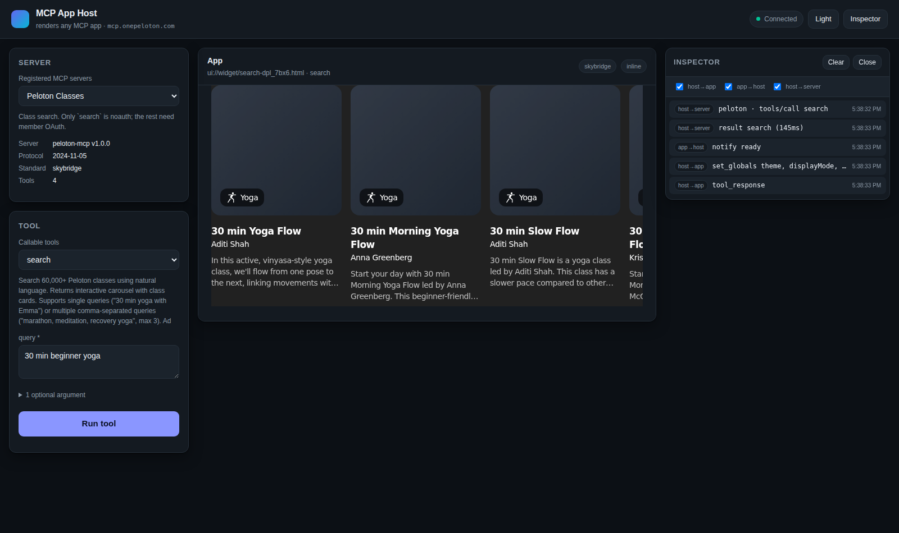

# MCP App Host

A front end that renders the interactive app from **any** MCP server, across **both**
widget standards, with no per-server code.

Generalised from two single-purpose front ends in this repo
([`viator-mcp-frontend`](../viator-mcp-frontend), [`peloton-mcp-frontend`](../peloton-mcp-frontend)),
which are kept as the worked examples the abstraction came from.



## Running it

```bash
cd mcp-app-host
npm start                    # → http://127.0.0.1:3200
```

Node 18+. No dependencies, no build step.

```bash
npm run probe -- <endpoint>  # inspect a server before registering it
npm test                     # 27 checks against live servers
```

| Variable | Default | Purpose |
| --- | --- | --- |
| `PORT` | `3200` | `0` picks a free port. |
| `HOST` | `127.0.0.1` | `0.0.0.0` listens on every interface. |
| `MCP_SERVERS_FILE` | `./servers.json` | Registry location. |

## Adding a server

```bash
npm run probe -- https://example.com/mcp --save --id example --label "Example"
```

Then restart and pick it from the dropdown. The full workflow — including the browser
checks that catch the failures a probe cannot — is in the
[`mcp-app-onboarding` skill](../.claude/skills/mcp-app-onboarding/SKILL.md).

## The problem it solves

Two incompatible widget standards are in the wild. A server declares which one it speaks
through the mime type of its UI resource:

| | `text/html;profile=mcp-app` | `text/html+skybridge` |
| --- | --- | --- |
| | **MCP Apps** (SEP-1865) | **OpenAI Apps SDK** |
| Transport | JSON-RPC over `postMessage` | Property access on `window.openai` |
| Handshake | `ui/initialize` → capabilities | None; the object must already exist |
| Data in | `ui/notifications/tool-result` | `openai.toolOutput` + `openai:set_globals` |
| Calling back | `tools/call` as JSON-RPC | `await openai.callTool(name, args)` |
| Sizing | App notifies `size-changed` | Host measures the document |
| Widget URI | `tool._meta.ui.resourceUri` | `tool._meta["openai/outputTemplate"]` |
| Theme | Live context update | Read once at boot — needs a remount |

Everything downstream follows from detecting that one mime type: which host
implementation runs, whether a shim is injected, and how the CSP is built.

## How it is put together

```
servers.json ──▶ registry.js ──▶ one MCP client per server
                                       │
tool._meta ────▶ detect.js ────────────┤   resolve widget URI + standard
                                       ▼
                                  server/index.js
                     /api/servers            the registry
                     /api/servers/:id/info   tools, schemas, resolved widgets
                     /api/servers/:id/widget the app, wrapped (+ shim if skybridge)
                     /api/servers/:id/tools/call
                                       │
                                       ▼
                     public/main.js ── builds the argument form from inputSchema
                                       │
                     public/hosts/index.js ── picks an adapter by standard
                            ├── mcp-apps-host.js   (JSON-RPC over postMessage)
                            └── skybridge-host.js  (+ skybridge-shim.js, injected)
```

Three things make it generic rather than two special cases welded together:

**Widget resolution is metadata-driven.** `templateForTool()` reads whichever `_meta` key
the server uses, falling back to the sole UI resource when a server declares exactly one.
The fallback is reported as `sole-ui-resource` so you know it was a guess.

**The argument form is generated from `inputSchema`.** Required fields first, optional
ones behind a disclosure, types mapped to real widgets — dates get a date picker, enums
get a select, objects and arrays get validated JSON. A server nobody has seen before is
immediately usable.

**The adapters expose one vocabulary** — `mount`, `deliver`, `setTheme`, `destroy` —
without pretending the standards are the same underneath. `remountForTheme` is the honest
seam: skybridge widgets read the theme once at boot, so the page must reload them, and the
adapter says so rather than hiding it.

## Security posture

- **The widget frame never gets `allow-same-origin`.** Skybridge widgets need a
  same-origin `window.openai`, so the server injects a shim into the widget document
  instead of loosening the sandbox. The widget gets its bridge; the frame stays closed.
- **`'self'` is never emitted in a widget CSP** — the frame runs on an opaque origin,
  where it would match nothing.
- **Tool calls are checked against the server's own `tools/list`,** so the proxy cannot be
  used to reach a tool the server does not advertise, or a tool on a different server.
- **Only `ui://` URIs are fetchable** through the widget route, and traversal is rejected.
- **Tokens live in the environment, never in `servers.json`** — an entry names the
  variable via `authEnv`.

## Registered servers

| id | Standard | Notes |
| --- | --- | --- |
| `viator` | mcp-apps | Tours and activities. No auth. |
| `peloton` | skybridge | Class search. Only `search` is `noauth`. |
| `deepwiki` | *none* | Data-only, included as the graceful-degradation case: the UI marks its tools "data only" rather than failing. |

## Known limits

- **Two standards only.** A third mime type returns HTTP 415 naming what it saw, rather
  than guessing. That is a real gap to fill, not something to paper over.
- **No OAuth flow.** `authEnv` sends a bearer you already have. Servers needing an
  interactive authorization code grant (Peloton's member tools, for example) will 401 —
  the UI reports that rather than hanging.
- **No model.** When an app sends a follow-up prompt, there is nothing to reason about it;
  the host re-runs the tool with that text in the first string argument, which is the most
  useful approximation available.
