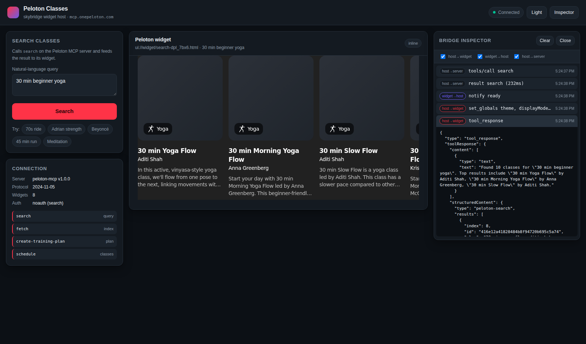

# Peloton MCP front end

A web front end that hosts Peloton's interactive class-search widget from its MCP server at
`https://mcp.onepeloton.com/mcp`.

It is the sibling of `../viator-mcp-frontend`, and deliberately so — the two solve the same
problem for **two incompatible widget standards**. That difference is the point of this
project.



## Running it

```bash
cd peloton-mcp-frontend
npm start           # → http://127.0.0.1:3100
```

Node 18+. No dependencies, no build step, no Peloton account.

```bash
npm run smoke       # server + live MCP calls
npm run e2e         # browser run; skips cleanly if playwright is absent
npm test            # both
```

| Variable | Default | Purpose |
| --- | --- | --- |
| `PORT` | `3100` | `0` picks a free port. |
| `HOST` | `127.0.0.1` | `0.0.0.0` listens on every interface. |
| `PELOTON_MCP_URL` | `https://mcp.onepeloton.com/mcp` | Upstream MCP endpoint. |

## Two standards, not one

Viator's server serves `text/html;profile=mcp-app` — an **MCP App** ([SEP-1865](https://modelcontextprotocol.io/)).
Peloton's serves `text/html+skybridge` — an **OpenAI Apps SDK** widget. They are not
interchangeable:

| | Viator (MCP Apps) | Peloton (skybridge) |
| --- | --- | --- |
| Transport | JSON-RPC over `postMessage` | Direct property access on `window.openai` |
| Handshake | `ui/initialize` → capabilities → `initialized` | None; the object must simply exist |
| Data in | `ui/notifications/tool-result` | `openai.toolOutput` + an `openai:set_globals` event |
| Calling back | `tools/call` as a JSON-RPC request | `await openai.callTool(name, args)` |
| Sizing | Widget notifies `size-changed` | Host measures the document itself |
| Discovery | `resources/list` | `_meta["openai/outputTemplate"]` on each tool |

So this project could not reuse the Viator host. It needed a different bridge.

## How the bridge works

A skybridge widget expects `window.openai` to already exist **on its own window**:

```js
const bridge = window.openai ?? window.oai ?? window.webplus;
bridge.toolOutput            // the render payload
await bridge.setWidgetState(s)
await bridge.requestDisplayMode({ mode })
```

The host page cannot assign that across an origin boundary. Rather than drop
`allow-same-origin` and hand the widget access to the page, the server **injects a shim into
the widget document** (`public/skybridge-shim.js`). The widget gets the same-origin bridge it
expects; the shim relays everything to the parent over `postMessage`; the frame keeps a real
sandbox.

```
 page  ──postMessage──▶  shim  ──window.openai──▶  Peloton widget
   ▲                      │
   └────── notify ────────┘        (host: public/skybridge-host.js)
```

Ordering matters in one place: the shim must run **before** the widget's own bootstrap, which
captures whatever `window.openai` already holds. It goes in `<head>`; the widget is `<body>`.

## Four things worth knowing

**Images render through Cloudinary, not S3.** Search results carry
`s3.amazonaws.com` URLs, but the widget rewrites every one through
`res.cloudinary.com/peloton-cycle/image/fetch/...` before rendering. A CSP derived from the
result payload looks correct and blocks every image. `npm run e2e` fails on any
`Refused to load`, which is how this was caught.

**Never measure `documentElement` for auto-height.** It is clamped to the iframe's own
viewport, so it reports back whatever height the host just set — the frame can never resize to
fit. The shim measures `document.body` instead. The first version of this reported a constant
620px, exactly the placeholder height.

**Theme has to be baked in at load.** Peloton's bootstrap reads `openai.theme` synchronously
to set its dark class, before any message could arrive. The server seeds
`window.__HOST_GLOBALS__` into the document, and the theme toggle remounts the widget rather
than pushing a global that nothing re-reads. The last result is replayed, so no search repeats.

**Only `search` is public.** Its `_meta.securitySchemes` is `[{"type":"noauth"}]`, which is
why this works with no account. `fetch`, `create-training-plan` and `schedule` operate on
member data and need the OAuth flow advertised at
`/.well-known/oauth-protected-resource` (scopes `peloton-api.members:default`, `claudeai`,
`openid`). The proxy surfaces a 401 from those as a readable message rather than a crash.

## Notes on the live API

- **Protocol 2024-11-05.** The server negotiates down from whatever is offered; the client
  honours whatever it picks and echoes it on later requests.
- **Mixed encodings.** `resources/read` answers with JSON, `tools/call` with
  `text/event-stream`. The client parses both.
- **Widgets are duplicated.** Each appears twice — `search.html` and `search-dpl_7bx6.html`.
  Tools point at the suffixed build via `openai/outputTemplate`, which is what this front end
  follows rather than guessing at the bare name.
- On networks that block `res.cloudinary.com`, cards render with grey placeholders. That is
  the CDN being unreachable, not a CSP problem.
