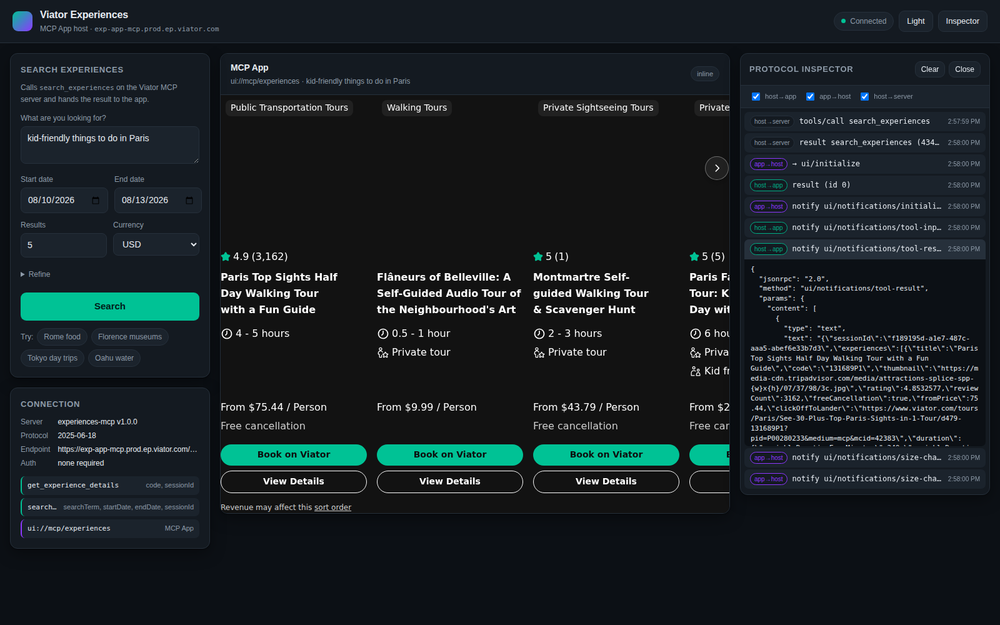

# Viator MCP front end

A web front end that hosts the **Viator Experiences MCP App**.

The [Viator Experiences MCP server](https://docs.viator.com/partner-api/mcp/) exposes two
tools and, alongside them, an interactive UI resource (`ui://mcp/experiences`) built to render
search results. Normally that UI is displayed by an AI client. This project is that client's
front end, minus the model: it searches Viator, embeds the app, and speaks the MCP Apps
protocol to it.

Everything runs against the live Viator server. There is no mock data, no API key, and no
build step.



## Running it

```bash
cd viator-mcp-frontend
npm start           # → http://127.0.0.1:3000
```

Node 18+. No dependencies.

```bash
npm run smoke       # server + live MCP calls (no browser needed)
npm run e2e         # full browser run; skips cleanly if playwright is absent
npm test            # both
```

| Variable | Default | Purpose |
| --- | --- | --- |
| `PORT` | `3000` | `0` picks a free port. |
| `HOST` | `127.0.0.1` | Bind address. |
| `VIATOR_MCP_URL` | `https://exp-app-mcp.prod.ep.viator.com/mcp` | Upstream MCP endpoint. |
| `VIATOR_APP_URI` | `ui://mcp/experiences` | UI resource to embed. |

Behind a corporate proxy, start with `NODE_USE_ENV_PROXY=1 npm start`.

## How it fits together

```
browser                        node server                 Viator
┌────────────────────────┐     ┌──────────────┐     ┌──────────────────┐
│ page  ⇄  app iframe    │ ──▶ │ /api/tools/… │ ──▶ │ MCP  (JSON-RPC   │
│   (postMessage JSON-RPC)│     │ /api/app.html│     │  Streamable HTTP)│
└────────────────────────┘     └──────────────┘     └──────────────────┘
```

The Node layer exists for one reason: the MCP endpoint is a server-to-server JSON-RPC service
with no CORS headers, so the browser cannot call it directly. It is a thin proxy —
`server/mcp-client.js` is a dependency-free MCP client, and `server/index.js` exposes four
routes:

| Route | Purpose |
| --- | --- |
| `GET /api/info` | Handshake result, tool list, resource list — drives the Connection panel. |
| `GET /api/app.html` | The MCP App, wrapped in a document and served under its declared CSP. |
| `GET /api/app-meta` | The resource's `_meta` and the CSP derived from it. |
| `POST /api/tools/call` | Proxies `tools/call`, restricted to the server's two tools. |

## The interesting part: hosting the app

`public/mcp-app-host.js` implements the **host** half of the MCP Apps protocol
([SEP-1865](https://modelcontextprotocol.io/)). The app resource is a ~900 KB HTML fragment
that runs in a sandboxed iframe and talks JSON-RPC over `postMessage`. The app is the client;
the page is the server it calls.

Startup:

```
app  → host   ui/initialize                  { appInfo, appCapabilities, protocolVersion }
host → app                                   { protocolVersion, hostInfo, hostCapabilities, hostContext }
app  → host   ui/notifications/initialized
host → app    ui/notifications/tool-input    the arguments search_experiences was called with
host → app    ui/notifications/tool-result   the payload the app renders
```

`tool-input` and `tool-result` are one-shot notifications, so each search mounts a **fresh**
iframe rather than re-feeding a live instance.

After that the app drives itself, and the host answers:

| From the app | Host behaviour |
| --- | --- |
| `tools/call` | Proxied upstream — this is how *View Details* fetches `get_experience_details`. |
| `ui/open-link` | Opens the Viator click-out (see the popup note below). |
| `ui/request-display-mode` | Expands to a fullscreen overlay, then confirms the mode actually applied. |
| `ui/notifications/size-changed` | Resizes the iframe to the app's content height. |
| `ui/message` | Treated as a follow-up search and re-run. |
| `resources/read`, `resources/list`, `ping` | Answered per spec. |

The host pushes `ui/notifications/host-context-changed` when the theme or container size
changes, which is why toggling light/dark restyles the app itself.

Open the **Inspector** to watch every frame in both directions, plus the upstream calls.

### Two things worth knowing

**Popups are blocked on click-out.** When you press *Book on Viator*, the click happens inside
the sandboxed iframe, so the top-level document has no transient user activation and
`window.open` is refused. The host detects the blocked popup and falls back to a toast with a
real link — clicking that is a gesture in the host document, which the browser allows. Without
this the click-out fails silently.

**The iframe deliberately omits `allow-same-origin`.** The app runs on an opaque origin and
cannot reach the page's DOM, cookies, or storage. That also means `'self'` is meaningless in
its CSP, so `buildCsp()` never emits it and instead expands the `connectDomains` /
`resourceDomains` the resource declares in its `_meta`.

## Notes on the live API

- **No authentication.** The MCP endpoint is public; no key is configured anywhere.
- **`endDate` is required in practice.** The published contract says it defaults to
  `startDate`, but the server rejects calls without it, so the front end always sends one.
- **Thumbnails carry `{w}x{h}` placeholders** that the app substitutes at render time.
- **Tool errors arrive inside HTTP 200** with `isError: true` and a human-readable message,
  per the MCP contract — the front end surfaces that text rather than a generic failure.
- **Empty results are a normal outcome.** The UI suggests widening dates, price, or location,
  which is the refinement guidance the tool contract asks clients to give.
- On networks that block `*.tripadvisor.com`, cards render with blank images. That is the
  image CDN being unreachable, not a CSP problem — a real CSP block logs `Refused to load`,
  which `npm run e2e` asserts against.
